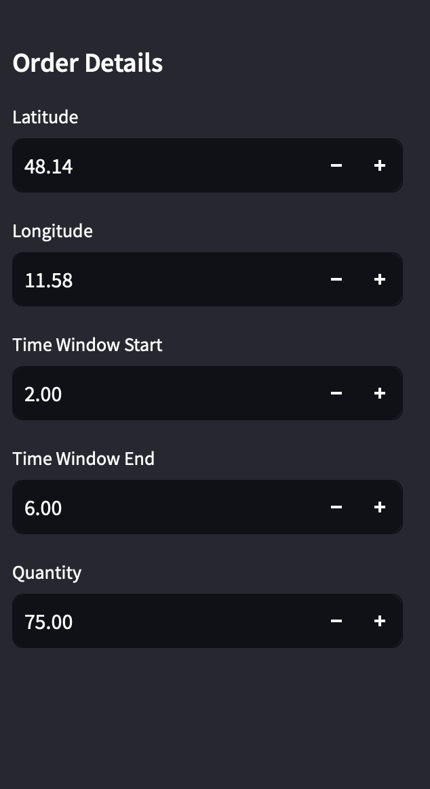
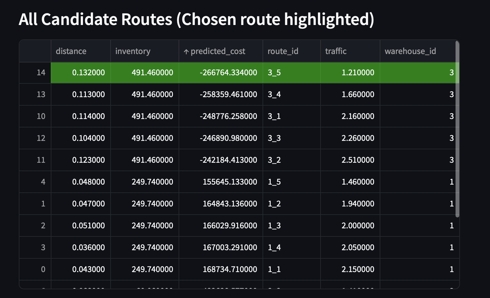
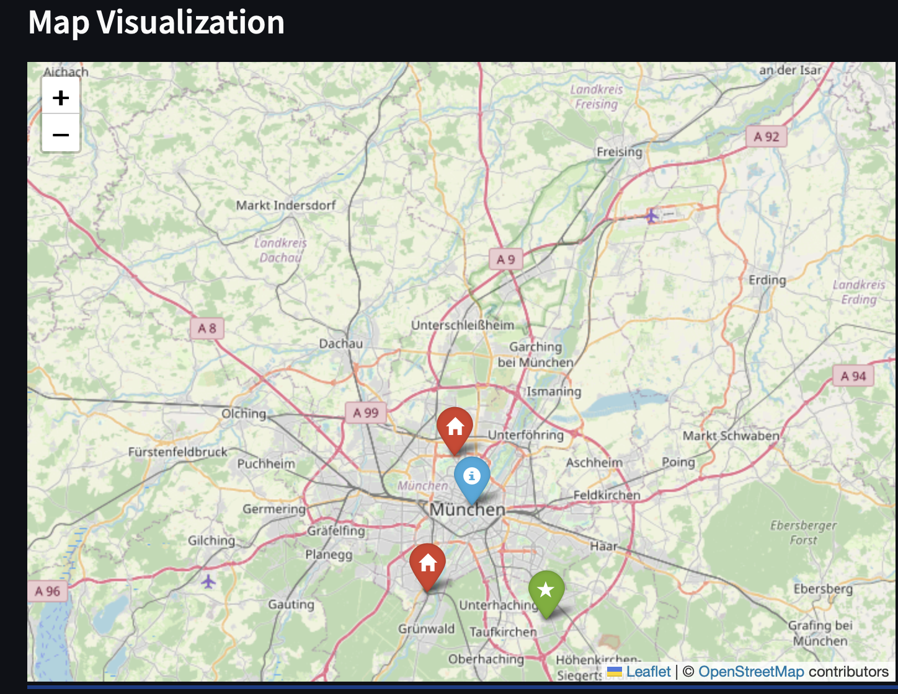

# Route Optimization App

This prototype demonstrates a **route optimization** solution that:

- **Generates** random warehouse data (with location, inventory) in an **SQLite database**.
- **Trains** a **linear regression** model on **synthetic route data**.
- **Uses** a **custom cost function** factoring in distance, traffic, time window constraints, requested quantity, and warehouse inventory levels.
- **Serves** a **Flask** REST API to return the best route (and all candidate routes).
- **Provides** a **Streamlit** front-end to input order details, visualize the chosen route on a map, and highlight all routes in a table.

## Installation & Setup

1. **Clone / Download** this repository.

2. **Install dependencies**:
   ```bash
   pip install -r requirements.txt
   ```
   
3. **Run the Flask backend**:
   ```bash
   python app.py
   ```
   - Initializes the database, populates **random warehouses**, and trains the regression model on startup.
   - The server listens on `http://127.0.0.1:5000`.

4. **Run the Streamlit frontend**:
   ```bash
   streamlit run streamlit_app.py
   ```
   - Opens a browser at `http://localhost:8501`.

## Usage

1. **Open** the Streamlit UI (`http://localhost:8501`).
2. **Enter** order details in the **sidebar**:
   - Latitude, Longitude
   - time_window_start, time_window_end
   - Quantity
3. **Click** “Optimize Route.”
4. **View**:
   - Best route chosen by the model.
   - A table of all candidate routes (with the chosen route highlighted).
   - A Folium map marking all warehouses (in red) and the chosen warehouse (in green), plus the order location in blue.

## AI Model & Training (Brief Overview)

- **Synthetic Data**: We generate random tuples of  
  ```
  (distance, time_window_start, time_window_end, traffic, warehouse_inventory, requested_quantity)
  ```
  then compute a **cost** for each sample (see below).  
- **Regression**: A **LinearRegression** model is trained to map these 6 features to the cost label.  
- **Inference**: At runtime, each candidate route is passed (plus the user’s `requested_quantity`) to the model, which predicts a cost.

## Cost Function Explanation

Cost is calculated by combining several factors:

1. **Base Cost**:  
   - The raw distance between warehouse and order.

2. **Traffic Cost**:  
   - Distance × Traffic factor.

3. **Time Penalty**:  
   - A penalty that grows as available time (`time_window_end - time_window_start`) shrinks.
   - Computed as: `alpha * traffic * (1 / available_time)`, with `alpha=10`.

4. **Inventory Benefit**:  
   - Subtract `0.02 × warehouse_inventory`, so higher inventory slightly lowers cost.

5. **Insufficient Inventory Penalty**:  
   - Adds 999999 if warehouse inventory < requested quantity, making that route effectively infeasible.

### Conceptual Formula

```
cost = (distance)
     + (distance × traffic)
     + (alpha × traffic × 1/(time_window_end - time_window_start))
     + (999999 if inventory < requested_quantity else 0)
     - (0.02 × warehouse_inventory)
```

## API Endpoints

- **POST /optimize**:  
  Expects JSON with:
  ```json
  {
    "latitude": 48.14,
    "longitude": 11.58,
    "time_window_start": 2.0,
    "time_window_end": 6.0,
    "quantity": 75
  }
  ```
  Returns JSON with:
  ```json
  {
    "best_route": {...},
    "all_routes": [...]
  }
  ```
- **GET /warehouses**:  
  Returns all warehouses in the database (ID, name, latitude, longitude, inventory).

## Testing & Evaluation

- **Unit Tests**: If you have test files (e.g., `tests/` folder), run them via `pytest`.
- **Performance**: This is a **prototype** solution. The model is trained on synthetic data, so real-world performance will differ. The main purpose is to demonstrate the approach, not to provide production-level accuracy.

---

Below is an **example section** you can add to your `README.md` that references images you’ve placed in your repository (e.g., in an `images/` folder). This shows how to embed the screenshots you provided, **and** how to describe them in the markdown text.

---

## Example Scenario

Suppose you enter the following order details in the **Streamlit** sidebar:


### 1. Sidebar for Order Details




Here, the user can modify the **Latitude**, **Longitude**, **Time Window** (start/end), and **Quantity**.

### 2. Candidate Routes Table

After clicking **Optimize Route**, the app generates multiple routes for each warehouse, displays them in a table, and **highlights** the best route in **green**. For instance:




The **green row** is the best route overall (lowest cost), factoring in **distance**, **traffic**, **time window** constraints, and **inventory**.

### 3. Map Visualization

Finally, the map shows:

- **Blue** marker for the order location.  
- **Red** markers for other warehouses.  
- **Green** marker for the chosen warehouse.



This **visual** check helps confirm *why* that particular warehouse was chosen: it has enough inventory, acceptable distance, and traffic/time constraints that yield the lowest cost.

---

**That’s it!** You can now install dependencies, run `app.py`, run `streamlit_app.py`, and explore the route optimization solution with the custom cost function.